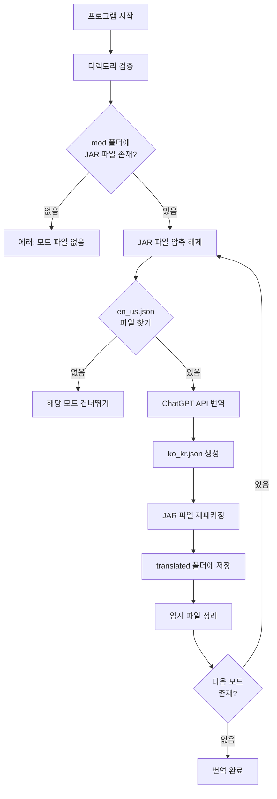
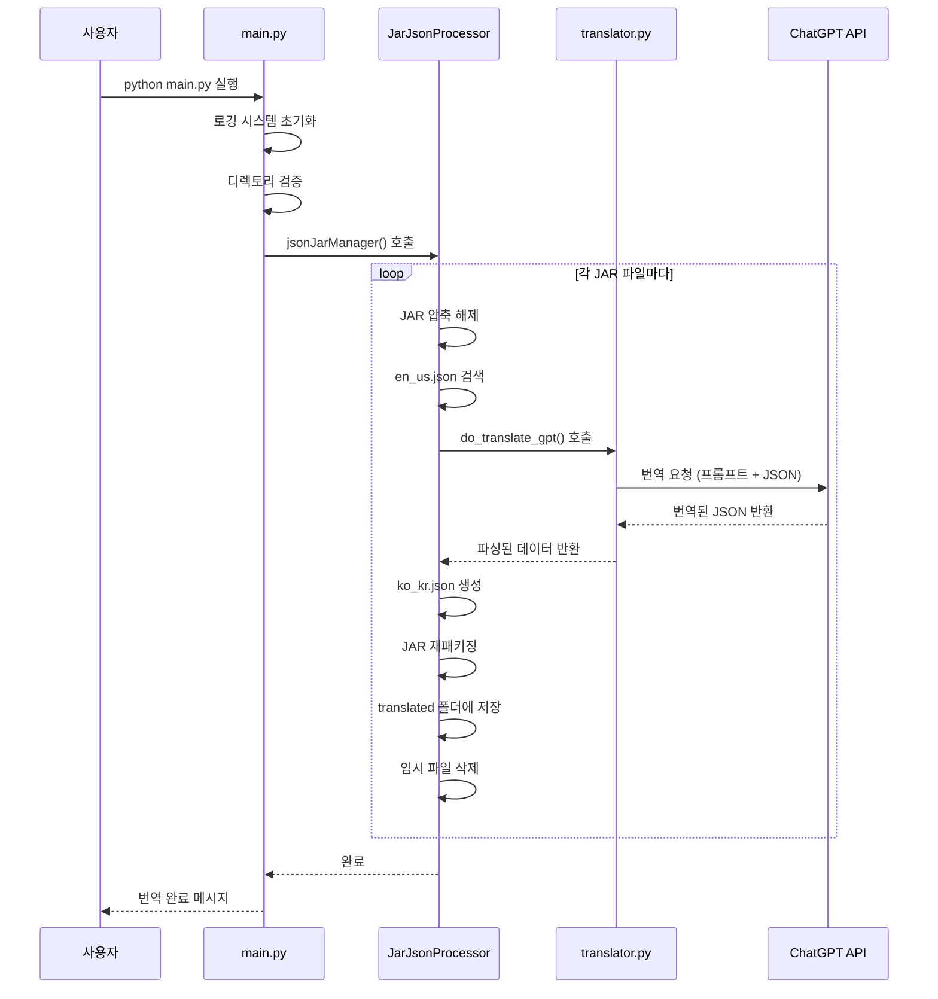
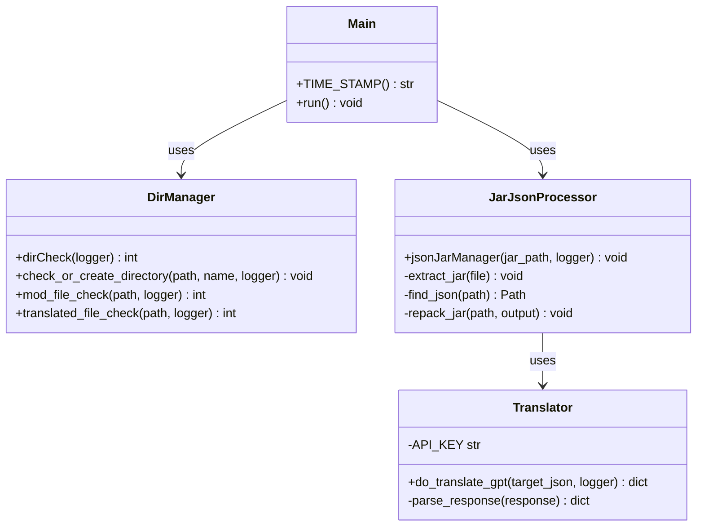
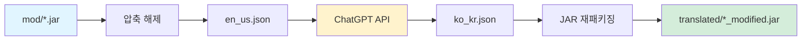
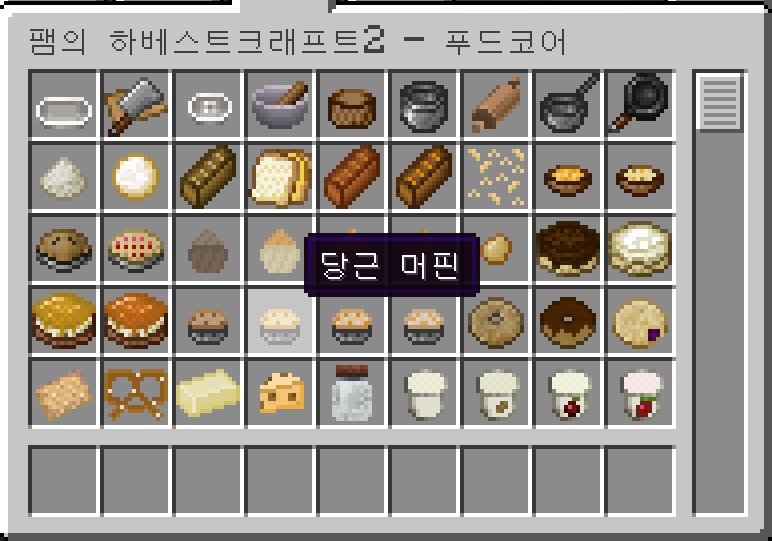

# Minecraft Mod Translator


**ChatGPT 기반 마인크래프트 모드 자동 번역기**

---

## 목차
1. [프로젝트 소개](#1-프로젝트-소개)
2. [시스템 동작 방식](#2-시스템-동작-방식)
3. [시작하기](#3-시작하기)
4. [사용 방법](#4-사용-방법)
5. [시스템 아키텍처](#5-시스템-아키텍처)
6. [문제 해결](#6-문제-해결)

---

## 1. 프로젝트 소개

### 1.1 개요
**Minecraft Mod Translator**는 OpenAI의 ChatGPT API를 활용하여 마인크래프트 모드를 자동으로 한글화하는 도구입니다.

> [!NOTE]
> 이 프로젝트는 **Beta 버전**입니다. 일부 문제가 발생할 수 있으니 양해 부탁드립니다.

### 1.2 주요 특징

**자동화된 번역 프로세스**
- JAR 파일에서 자동으로 `en_us.json` 추출
- ChatGPT를 활용한 고품질 번역
- 번역된 `ko_kr.json` 자동 생성 및 재패키징

**비용 효율성**
- **ChatGPT API**: $5로 충분한 번역 가능
- **Papago API**: 한 번 사용에 약 20,000원 소요
- 약 **75% 비용 절감** 효과

**높은 정확도**
- 게임 전문 번역가 프롬프트 적용
- JSON 구조 유지 (Key는 보존, Value만 번역)
- 마인크래프트 용어에 최적화된 번역

**간편한 사용**
- 모드 파일을 폴더에 넣고 실행만 하면 완료
- 자동 로깅으로 진행 상황 추적
- 에러 핸들링 및 복구 기능

### 1.3 기술 스택
- **언어**: Python 3.x
- **AI 모델**: OpenAI GPT-4o
- **주요 라이브러리**: 
  - `openai==1.54.4` - ChatGPT API 연동
  - `commentjson` - 주석이 포함된 JSON 파싱
- **지원 버전**: Minecraft 1.18.x ~ 1.21.x (Forge 모드)

---

## 2. 시스템 동작 방식

### 2.1 전체 프로세스 플로우



### 2.2 번역 프로세스 상세



---

## 3. 시작하기

### 3.1 필수 요구사항

> [!IMPORTANT]
> 시작하기 전에 다음 항목들을 준비해주세요.

**1. Python 설치**
- Python 3.7 이상 필요

**2. OpenAI API 키 발급**
- [OpenAI API Platform](https://platform.openai.com/)에서 계정 생성
- API 키 발급 (결제 정보 등록 필요)
- 최소 $5 충전 권장

**3. 필수 라이브러리 설치**

```bash
pip install -r requirements.txt
```

또는 개별 설치:

```bash
pip install commentjson
pip install openai==1.54.4
```

### 3.2 API 키 설정

`translator.py` 파일을 열어 본인의 API 키를 입력합니다:

```python
# translator.py 파일의 5번째 줄
API_KEY = "YOUR_API_KEY"  # 여기에 발급받은 API 키 입력
```

> [!WARNING]
> API 키는 절대 공개 저장소에 업로드하지 마세요!

---

## 4. 사용 방법

### 4.1 기본 사용법

**Step 1: 모드 파일 준비**

프로젝트 폴더에 `mod` 폴더를 생성하고 번역할 `.jar` 파일을 넣습니다.

```
minecraft-Mod-Translator/
├── mod/                    ← 여기에 모드 파일 넣기
│   ├── example_mod_1.jar
│   └── example_mod_2.jar
├── main.py
└── ...
```

> [!TIP]
> `mod` 폴더가 없다면 프로그램을 한 번 실행하면 자동으로 생성됩니다.

**Step 2: 번역 실행**

터미널에서 다음 명령어를 실행합니다:

```bash
python main.py
```

**Step 3: 번역 완료 확인**

번역이 완료되면 `translated` 폴더에 번역된 모드 파일이 생성됩니다:

```
minecraft-Mod-Translator/
├── translated/             ← 번역된 파일이 여기에 생성됨
│   ├── example_mod_1_modified.jar
│   └── example_mod_2_modified.jar
└── ...
```

**Step 4: 게임에 적용**

번역된 `.jar` 파일을 마인크래프트 모드 폴더에 복사합니다:

```
%appdata%\.minecraft\mods\
```

### 4.2 로그 확인

번역 과정은 `log` 폴더에 자동으로 기록됩니다:

```
minecraft-Mod-Translator/
├── log/
│   └── 2025-12-04_12-00-00.log  ← 실행 시간별 로그 파일
└── ...
```

로그 파일에서 다음 정보를 확인할 수 있습니다:
- 각 모드의 처리 상태
- 번역 성공/실패 여부
- 에러 메시지 및 경고

---

## 5. 시스템 아키텍처

### 5.1 컴포넌트 구조



### 5.2 주요 모듈 설명

#### 5.2.1 main.py - 메인 실행 모듈

프로그램의 진입점으로 전체 프로세스를 조율합니다.

**주요 기능:**
- 로깅 시스템 초기화
- 디렉토리 검증 실행
- 번역 프로세스 시작

```python
def run():
    # 로깅 초기화
    logger = logging.getLogger('mod-translator')
    logging.basicConfig(
        format='%(asctime)s %(levelname)s:%(message)s',
        filename=f"./log/{TIME_STAMP()}.log",
        level=logging.DEBUG
    )
    
    # 디렉토리 검증
    dirCheck(logger)
    
    # 번역 시작
    jsonJarManager('./mod', logger=logger)
```

#### 5.2.2 DirManager.py - 디렉토리 관리 모듈

필요한 디렉토리를 생성하고 파일 상태를 검증합니다.

**주요 기능:**
- `mod`, `translated` 폴더 자동 생성
- 모드 파일 존재 여부 확인
- 기존 번역 파일 충돌 경고

**검증 로직:**

```python
def dirCheck(logger: logging.Logger) -> int:
    """
    Returns:
        0: 정상
        -1: mod 폴더에 파일 없음 (에러)
        -2: translated 폴더에 기존 파일 존재 (경고)
    """
```

#### 5.2.3 JarJsonProcessor.py - JAR 파일 처리 모듈

JAR 파일의 압축 해제, JSON 추출, 재패키징을 담당합니다.

**처리 과정:**

1. **압축 해제**
```python
with zipfile.ZipFile(mod_file, 'r') as jar:
    jar.extractall(mod_temp_dir)
```

2. **JSON 파일 검색**
```python
target_json_path = next(mod_temp_dir.rglob('en_us.json'), None)
```

3. **번역 실행**
```python
translated_data = do_translate_gpt(target_json=json_str, logger=logger)
```

4. **ko_kr.json 생성**
```python
ko_kr_path = target_json_path.parent / 'ko_kr.json'
with ko_kr_path.open('w', encoding='utf-8') as json_file:
    commentjson.dump(translated_data, json_file, ensure_ascii=False, indent=4)
```

5. **JAR 재패키징**
```python
shutil.make_archive(new_jar_file.with_suffix(''), 'zip', mod_temp_dir)
```

#### 5.2.4 translator.py - 번역 엔진 모듈

ChatGPT API를 활용한 실제 번역을 수행합니다.

**프롬프트 전략:**

```python
messages=[
    {"role": "system", "content": "당신은 게임전문 번역가입니다. 번역하고자 하는 게임은 마인크래프트입니다."},
    {"role": "system", "content": "딕셔너리 형태의 데이터를 넘겨드릴겁니다. Key값은 그대로두고 Value값만 번역해야합니다."},
    {"role": "system", "content": "영어를 한글로 번역하는 작업이며, 답변은 Json 형태로만 주시면 됩니다."},
    {"role": "user", "content": target_json}
]
```

**응답 파싱:**
```python
# GPT 응답에서 JSON 추출 (마크다운 코드 블록 제거)
translated_json_str = response.choices[0].message.content
translated_data = commentjson.loads(translated_json_str[7:-3].strip())
```

### 5.3 데이터 흐름



---

## 6. 문제 해결

### 6.1 자주 발생하는 문제

#### "Mod Directory Status: Error"

**원인:** `mod` 폴더에 JAR 파일이 없습니다.

**해결:**
```bash
# mod 폴더에 .jar 파일을 추가하세요
minecraft-Mod-Translator/mod/your_mod.jar
```

#### "en_us.json not found"

**원인:** 해당 모드에 영어 언어 파일이 없습니다.

**해결:** 
- 이 모드는 번역이 불가능합니다 (언어 파일이 없는 모드)
- 로그에서 건너뛰었다는 메시지 확인 가능

#### "An error occurred during translation"

**원인:** API 키 오류 또는 네트워크 문제

**해결:**
1. `translator.py`의 API_KEY가 올바른지 확인
2. OpenAI 계정에 충분한 크레딧이 있는지 확인
3. 인터넷 연결 상태 확인

#### "Translated Directory Status: Warning"

**원인:** `translated` 폴더에 이미 파일이 존재합니다.

**해결:**
- 기존 파일을 백업하거나 삭제 후 재실행
- 또는 그대로 진행 (덮어쓰기됨)

### 6.2 로그 분석

로그 레벨별 의미:

| 레벨 | 의미 | 조치 |
|------|------|------|
| **INFO** | 정상 진행 상황 | 조치 불필요 |
| **WARNING** | 경고 (진행 가능) | 확인 권장 |
| **ERROR** | 오류 발생 | 즉시 확인 필요 |
| **DEBUG** | 상세 디버그 정보 | 개발자용 |

### 6.3 지원되는 모드 형식

**지원:**
- `.jar` 형식의 Forge 모드
- `assets/*/lang/en_us.json` 구조를 가진 모드
- JSON 형식의 언어 파일

**미지원:**
- Fabric 모드 (일부 호환 가능)
- `.lang` 형식의 구 버전 언어 파일
- 언어 파일이 없는 모드

---

## 스크린샷

### 실행 화면


---

## 참고 사항

1. **비용 관리**
   - GPT-4o 모델 사용 시 토큰당 과금
   - 일반적인 모드 하나당 약 $0.10 ~ $0.50 소요
   - $5로 약 10~50개 모드 번역 가능

2. **번역 품질**
   - ChatGPT의 문맥 이해 능력으로 자연스러운 번역
   - 게임 용어에 최적화된 프롬프트 적용
   - 일부 전문 용어는 수동 검토 권장

3. **백업 권장**
   - 원본 모드 파일은 항상 백업 보관
   - 번역된 모드가 정상 작동하는지 테스트 후 사용

4. **라이선스**
   - 개인 사용 목적으로 제작된 도구입니다
   - 모드 제작자의 라이선스를 존중해주세요

---

## 감사의 말

이 프로젝트는 취미로 시작했지만 예상외로 많은 분들이 관심을 가져주셔서 감사합니다.  
Star를 눌러주신 모든 분들께 진심으로 감사드립니다!

---

## 라이선스

이 프로젝트는 MIT 라이선스 하에 배포됩니다. 자세한 내용은 [LICENSE](LICENSE) 파일을 참조하세요.
