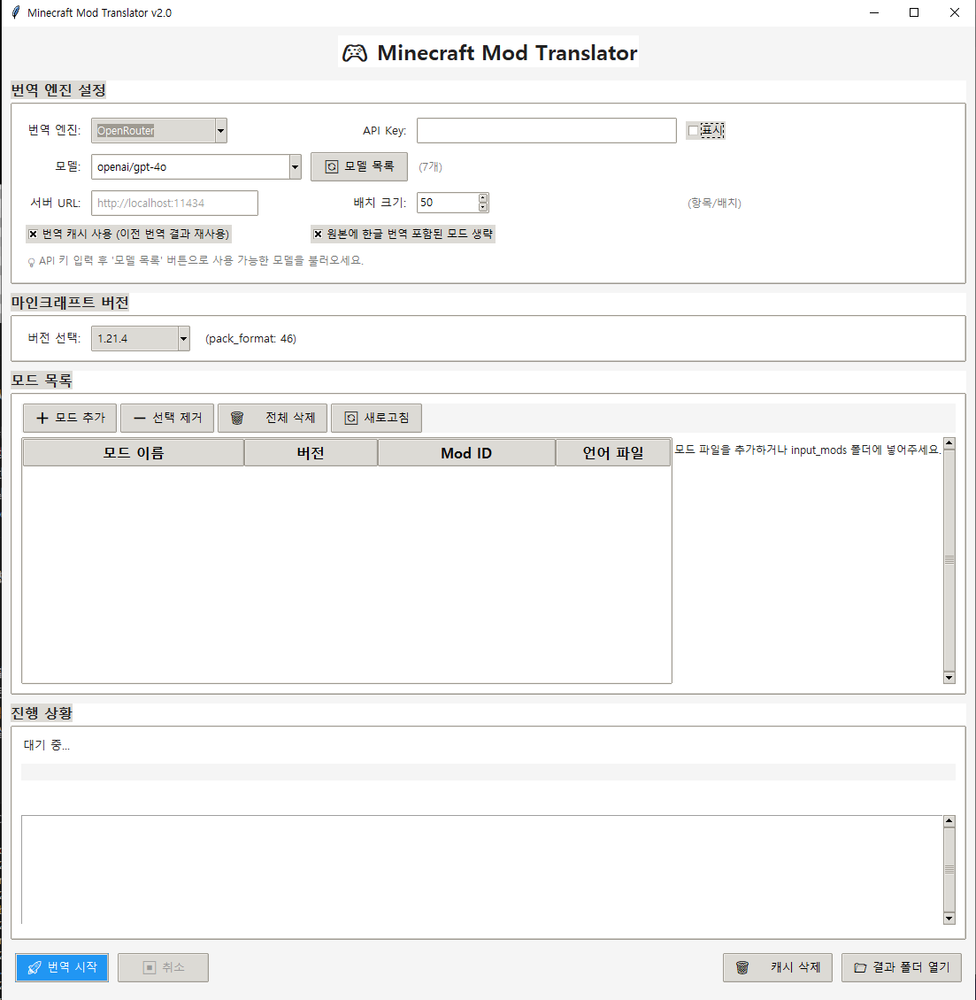

# Minecraft Mod Translator v2.0


**AI 기반 마인크래프트 모드 자동 번역기**

> 다중 LLM 지원 | 번역 캐시 | GUI 인터페이스 | Resource Pack 생성 | 비영어권 모드 지원

---

## 📸 미리보기

### 프로그램 인터페이스

*직관적인 GUI를 통해 번역 엔진 설정, 모드 관리, 진행 상황 확인이 가능합니다.*

### 번역 결과 예시

*AI를 통해 문맥에 맞는 자연스러운 한국어 번역을 제공합니다.*

---

## 1. 프로젝트 소개

### 1.1 개요
**Minecraft Mod Translator v2.0**은 최신 AI 모델(GPT-4o, Claude 3, Llama 3 등)을 활용하여 마인크래프트 모드를 자동으로 한글화하는 도구입니다.

**모드 파일을 직접 수정하지 않고** Resource Pack(리소스팩) 형태로 번역을 생성하므로, 모드 원본의 무결성을 유지하면서 안전하게 번역을 적용할 수 있습니다.

### 1.2 v2.0의 주요 특징

| 기능 | 설명 |
|------|------|
| **다중 LLM 지원** | OpenAI, OpenRouter, Ollama(로컬) 등 다양한 엔진 선택 가능 |
| **모델 자동 탐색** | Ollama 로컬 모델 및 API 기반 모델 목록 자동 동기화 |
| **스마트 캐시** | 동일한 모드/버전은 재번역 없이 즉시 로드하여 비용과 시간 절감 |
| **원본 번역 보존** | 모드 내에 이미 한글 번역이 포함된 경우 자동으로 감지하여 생략 가능 |
| **다국어 지원** | 포르투갈어, 중국어 등 영어가 아닌 언어로 작성된 모드도 한국어로 번역 |
| **배치 최적화** | 대용량 언어 파일을 분할 처리하여 로컬 LLM의 VRAM 부족 문제 해결 |

---

## 2. 시작하기

### 2.1 필수 요구사항
- **Python 3.10 이상**
- **Ollama** (로컬 모델 사용 시)
- **API Key** (OpenAI 또는 OpenRouter 사용 시)

### 2.2 설치 방법
```bash
# 저장소 클론
git clone https://github.com/lazylee-l2i/minecraft-Mod-Translator.git
cd minecraft-Mod-Translator

# 의존성 설치
pip install -r requirements.txt
```

---

## 3. 사용 방법

### 3.1 프로그램 실행
```bash
python -m src.main
```

### 3.2 번역 단계
1. **엔진 설정**: 사용할 LLM 제공자를 선택하고 필요한 경우 API 키를 입력합니다.
2. **모델 선택**: `🔄 모델 목록` 버튼을 눌러 사용 가능한 모델을 불러온 후 선택합니다.
3. **버전 설정**: 대상 마인크래프트 버전을 선택합니다 (리소스팩 포맷 자동 결정).
4. **모드 추가**: 번역할 모드(`.jar`) 파일을 `input_mods` 폴더에 넣거나 UI에서 추가합니다.
5. **옵션 확인**: '번역 캐시 사용' 및 '원본 번역 포함 모드 생략' 옵션을 확인합니다.
6. **번역 시작**: `🚀 번역 시작` 버튼을 클릭합니다.

### 3.3 리소스팩 적용
- 번역이 완료되면 `result_pack/Translated_ResourcePack.zip` 파일이 생성됩니다.
- 이 파일을 마인크래프트의 `resourcepacks` 폴더에 넣고 게임 내 설정에서 활성화하세요.

---

## 4. 프로젝트 구조
```
src/
├── core/           # 번역 엔진, JAR 추출, 리소스팩 생성 로직
├── ui/             # Tkinter 기반 GUI 컴포넌트 및 스타일
├── config/         # 앱 상수 및 마인크래프트 버전별 설정
├── models/         # 데이터 구조 정의
└── utils/          # 로깅, 파일 관리, 예외 처리
```

---

## 5. 라이선스
이 프로젝트는 **MIT License**를 따릅니다.

---

## 6. 기여하기
버그 제보나 기능 제안은 Issue를 통해 남겨주세요. PR은 언제나 환영합니다!
